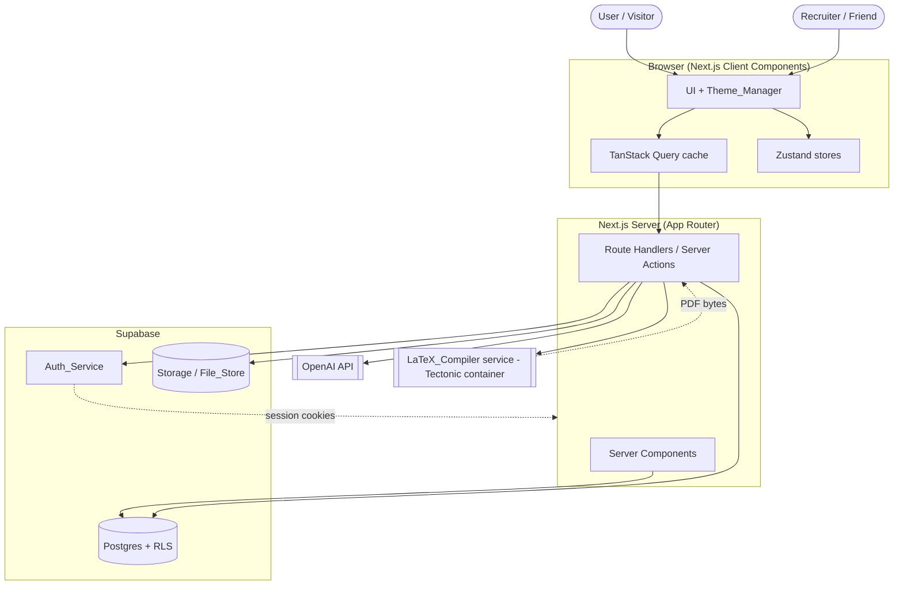
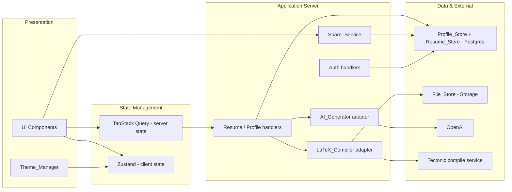
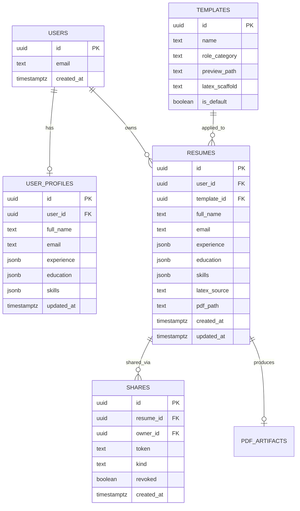
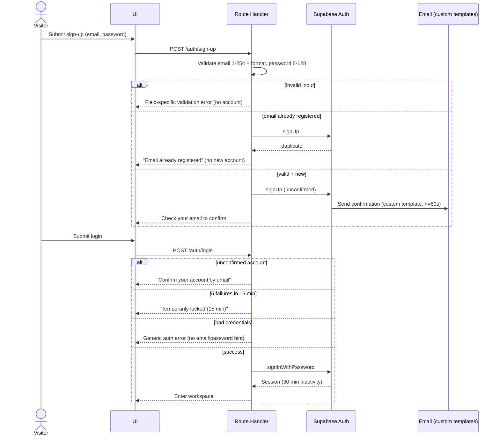
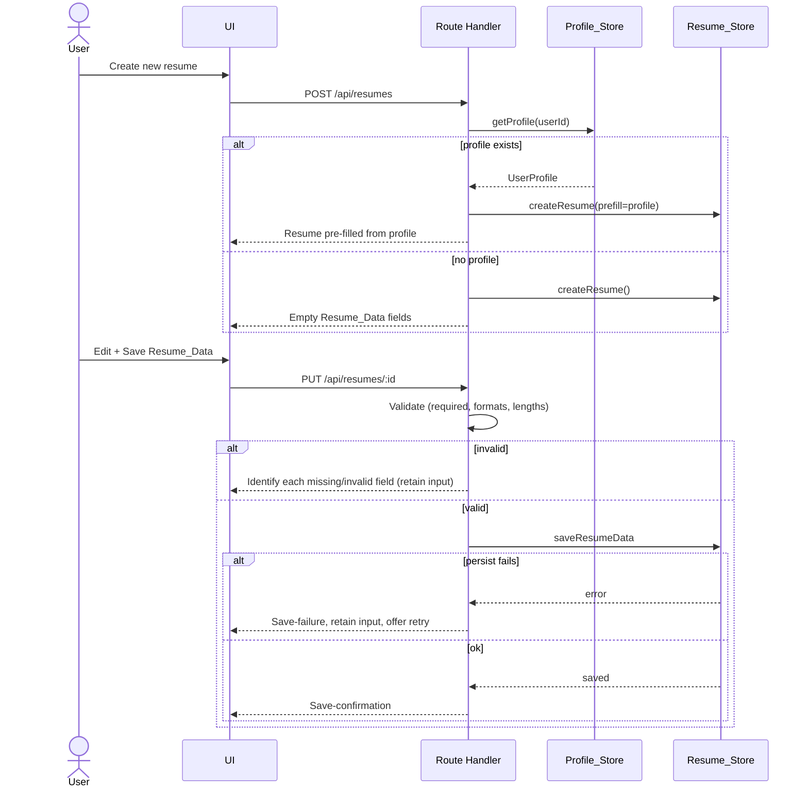
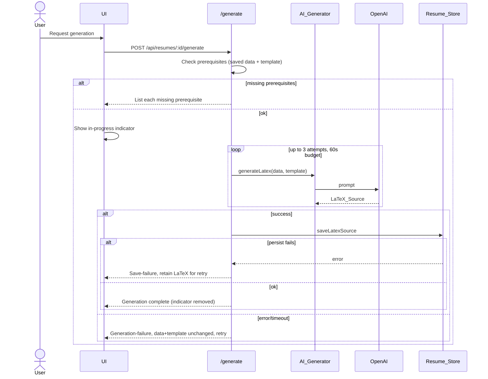
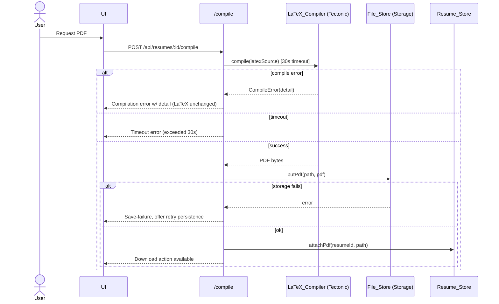
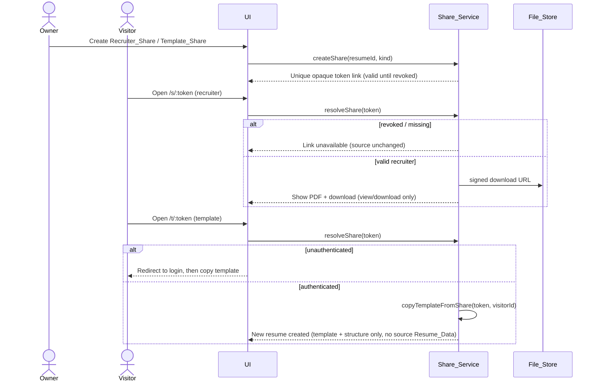

# Design Document

## Overview

The AI Resume Builder is a Next.js (App Router) web application that lets authenticated users create, generate, and share professional resumes. Users sign in through Supabase (email/password and Google OAuth), maintain a reusable `User_Profile`, enter or pre-fill `Resume_Data`, select a role-based template, and request AI generation. OpenAI produces LaTeX source from the structured data and template; a dedicated server-side LaTeX compiler turns that source into a PDF stored in Supabase Storage. Users can then share resumes with recruiters (view/download the PDF) or with friends (copy the template/structure).

The design honors these established technology decisions:

| Concern | Technology |
| --- | --- |
| Frontend / routing | Next.js App Router (React Server Components + Route Handlers) |
| Auth, database, storage | Supabase (Auth, Postgres, Storage) |
| AI generation | OpenAI API (LaTeX source generation) |
| LaTeX → PDF | Dedicated server-side Tectonic-based compile service (container) |
| Server state | TanStack Query |
| Client state | Zustand |
| Typography | Rubik typeface with system sans-serif fallback |
| Theming | Light/dark via CSS variables + `Theme_Manager` |

This design maps each component back to the requirements it satisfies and documents the key flows: authentication and recovery, resume data entry and profile reuse, AI generation, LaTeX compilation, sharing, theming, and access control.

### Key Design Decisions and Rationale

**LaTeX compilation runs in a dedicated container service, not in a Next.js serverless function.**
A full TeX distribution is hundreds of megabytes and requires system binaries, which exceeds the size and runtime constraints of typical serverless/edge functions (e.g., Vercel functions). The design uses [Tectonic](https://tectonic-typesetting.github.io/en-US/) — a modernized, self-contained TeX/LaTeX engine powered by XeTeX and TeXLive — packaged in a Docker container exposing a small REST endpoint (`POST /compile` returning a PDF). Tectonic is chosen because it is self-contained, fetches packages on demand with a primable cache, and produces deterministic output. (Content was rephrased for compliance with licensing restrictions.)

Tradeoffs:
- **Dedicated Tectonic container (chosen):** Full control over the toolchain, no per-compile vendor cost, predictable latency once the package cache is warm, deployable to any container host (Fly.io, Render, Railway, AWS Fargate, Cloud Run). Requires operating one extra service and managing a sandbox for untrusted-ish input.
- **Hosted compile API (e.g., third-party LaTeX-as-a-service):** Less operational burden, but adds per-request cost, a data-egress/privacy concern (resume content leaving our trust boundary), rate limits, and an external dependency on the critical path.
- **Compile inside a Next.js serverless function:** Rejected — TeX binaries do not fit the function size/cold-start budget and cannot be reliably bundled.

The Next.js backend treats the compiler as an internal HTTP dependency behind a server-only secret, enforces the 30-second timeout from Requirement 7, and never exposes the compiler directly to the browser.

**Security boundary: all data access goes through Supabase Row-Level Security (RLS).** Rather than relying solely on application-layer checks, every table that holds user data has RLS policies keyed on `auth.uid()`. This makes Requirement 10 (Access Control) enforceable at the database layer even if an application bug slips through.

**Share access uses unguessable tokens resolved server-side.** Share links carry a high-entropy opaque token. Resolution happens in server code using the Supabase service role (bypassing RLS) but constrained to the exact access level recorded in the share row, so anonymous recruiters can read a PDF without being able to reach any other data.

## Architecture

### System Context



### Layered Responsibilities



The presentation layer never talks to external services or the database directly. All privileged operations (OpenAI calls, compiler calls, Storage writes, share resolution with the service role) run server-side in Route Handlers / Server Actions so that secrets and the service role key never reach the browser.

### Request Flow Summary

- **Read-heavy workspace data** (resumes, profile, templates) is fetched in Server Components for first paint and hydrated into TanStack Query for client-side mutations and refetching.
- **Mutations** (save resume, save profile, generate, compile, create/revoke share) go through Route Handlers or Server Actions, which enforce auth, apply validation, call external services, and rely on RLS as a backstop.
- **Anonymous share access** is served by dedicated public routes that resolve the token server-side.

## Components and Interfaces

### UI (Next.js front-end)

Responsible for rendering the workspace, gallery, editors, and share pages. Composed of:
- **Auth pages**: login, sign-up, forgot-password, custom password-reset page, confirmation-expired page. (Requirements 1, 2, 3)
- **Workspace**: resume list, resume editor (`Resume_Data` form), `User_Profile` editor. (Requirements 5, 11)
- **Template gallery**: previews, role-category filter, empty states. (Requirement 4)
- **Generation & download panel**: generate button, in-progress indicator, retry, download action. (Requirements 6, 7)
- **Sharing panel**: create Recruiter_Share / Template_Share, list and revoke links. (Requirement 8)
- **Public share pages**: recruiter PDF viewer/download, template-copy landing. (Requirements 8, 10)

### Theme_Manager

Client component + Zustand slice controlling `light`/`dark` mode via a `data-theme` attribute and CSS variables. Persists the selection (localStorage keyed to the session) and applies the last selected theme on return, defaulting to light. Loads Rubik with a system sans-serif fallback. (Requirement 9)

### Auth_Service (Supabase Auth adapter)

Wraps Supabase Auth for sign-up, login, OAuth, confirmation, lockout, and password reset. Configured with custom email templates (sign-up confirmation, forgot-password) and a custom reset redirect URL pointing at the in-app reset page. (Requirements 1, 2, 3)

Interface (server-side):
```ts
interface AuthService {
  signUp(email: string, password: string): Promise<Result<AccountPending>>;
  login(email: string, password: string): Promise<Result<Session>>;
  startGoogleOAuth(): Promise<{ redirectUrl: string }>;
  completeOAuth(code: string): Promise<Result<Session>>;
  requestPasswordReset(email: string): Promise<void>; // always same outward result
  resetPassword(token: string, newPassword: string): Promise<Result<void>>;
  resendConfirmation(email: string): Promise<void>;
}
```

Email/password validation (email 1–254 chars valid format; password 8–128 chars), duplicate-email handling, generic auth errors, unconfirmed-login denial, and 5-attempt/15-minute lockout are enforced here. (Requirement 1)

### Template_Service

Provides role-based templates with preview assets and category filtering, plus a single predefined default template. Templates store the LaTeX scaffolding/structure the AI_Generator targets. (Requirement 4)

```ts
interface TemplateService {
  listTemplates(roleCategory?: string): Promise<Template[]>;
  getDefaultTemplate(): Promise<Template>;
  applyTemplate(resumeId: string, templateId: string): Promise<Result<void>>;
}
```

### Profile_Store

Persists and retrieves the reusable `User_Profile`. Validates required fields and length limits, and is the source for pre-filling new resumes. (Requirement 11)

```ts
interface ProfileStore {
  getProfile(userId: string): Promise<UserProfile | null>;
  saveProfile(userId: string, profile: UserProfileInput): Promise<Result<UserProfile>>;
}
```

### Resume_Store

Persists structured `Resume_Data`, the associated template, and generated `LaTeX_Source`; coordinates PDF persistence with the File_Store. (Requirements 5, 6, 7)

```ts
interface ResumeStore {
  createResume(userId: string, prefill?: UserProfile, template?: Template): Promise<Resume>;
  getResume(userId: string, resumeId: string): Promise<Resume | null>;
  saveResumeData(resumeId: string, data: ResumeDataInput): Promise<Result<Resume>>;
  saveLatexSource(resumeId: string, latex: string): Promise<Result<void>>;
  attachPdf(resumeId: string, storagePath: string): Promise<Result<void>>;
}
```

### AI_Generator (OpenAI adapter)

Server-side adapter that builds a prompt from validated `Resume_Data` + selected template and calls OpenAI to produce `LaTeX_Source`. Enforces a 60-second budget, retries up to 3 attempts per request, and validates prerequisites before calling. (Requirement 6)

```ts
interface AIGenerator {
  generateLatex(input: {
    resumeData: ResumeData;
    template: Template;
  }): Promise<Result<{ latex: string }>>; // bounded to 60s, 3 attempts
}
```

### LaTeX_Compiler (Tectonic service adapter)

Server-side adapter that POSTs `LaTeX_Source` to the internal Tectonic compile service and returns PDF bytes, enforcing a 30-second timeout and surfacing compiler error detail on failure. (Requirement 7)

```ts
interface LatexCompiler {
  compile(latex: string): Promise<Result<{ pdf: Uint8Array }, CompileError>>; // 30s timeout
}
```

### File_Store (Supabase Storage adapter)

Stores generated PDFs and template preview assets in a private bucket; issues short-lived signed URLs for downloads. (Requirements 7, 4, 8)

```ts
interface FileStore {
  putPdf(path: string, pdf: Uint8Array): Promise<Result<{ path: string }>>;
  getSignedDownloadUrl(path: string, ttlSeconds: number): Promise<string>;
}
```

### Share_Service

Creates, resolves, and revokes share links. Generates high-entropy opaque tokens, records the access level (`recruiter` = view/download PDF; `template` = copy template/structure), and resolves tokens server-side with strict access-level enforcement. (Requirements 8, 10)

```ts
interface ShareService {
  createShare(userId: string, resumeId: string, kind: 'recruiter' | 'template'): Promise<Share>;
  resolveShare(token: string): Promise<Result<ResolvedShare, ShareError>>;
  revokeShare(userId: string, shareId: string): Promise<Result<void>>;
  copyTemplateFromShare(token: string, intoUserId: string): Promise<Result<Resume>>;
}
```

## Data Models

### Entity Relationship



### TypeScript Domain Types

```ts
type ExperienceEntry = {
  title: string;        // <= 200 chars
  organization: string; // <= 200 chars
  startDate: string;
  endDate: string | null;
  description: string;  // <= 2000 chars
};

type EducationEntry = {
  institution: string;  // <= 200 chars
  credential: string;   // <= 200 chars
  startDate: string;
  endDate: string | null;
  description: string;  // <= 2000 chars
};

type ResumeData = {
  fullName: string;     // required, <= 200 chars
  email: string;        // required, valid format, <= 254 chars
  experience: ExperienceEntry[]; // <= 50 entries
  education: EducationEntry[];    // <= 50 entries
  skills: string[];               // <= 50 entries, each <= 200 chars
};

type UserProfile = ResumeData & { id: string; userId: string; updatedAt: string };

type Template = {
  id: string;
  name: string;
  roleCategory: string;
  previewPath: string;
  latexScaffold: string;
  isDefault: boolean;
};

type Resume = ResumeData & {
  id: string;
  userId: string;
  templateId: string | null;
  latexSource: string | null;
  pdfPath: string | null;
};

type Share = {
  id: string;
  resumeId: string;
  ownerId: string;
  token: string;
  kind: 'recruiter' | 'template';
  revoked: boolean;
};
```

### Validation Rules (shared schema)

A single validation schema (e.g., Zod) is shared between `Resume_Data` and `User_Profile` because both have identical field constraints (Requirements 5.1, 5.3, 5.6, 11.8):

- `fullName`: required, non-empty after trim, ≤ 200 chars.
- `email`: required, valid email format, ≤ 254 chars.
- Single-line text fields: ≤ 200 chars.
- Multi-line description fields: ≤ 2,000 chars.
- Repeatable sections (experience, education, skills): ≤ 50 entries each.
- Validation returns the complete set of failing fields, not just the first.

### Database Schema and Row-Level Security

All user-owned tables enable RLS. Policies restrict every operation to rows where `user_id = auth.uid()`. (Requirement 10)

```sql
-- user_profiles
alter table user_profiles enable row level security;
create policy "own_profile_select" on user_profiles
  for select using (user_id = auth.uid());
create policy "own_profile_modify" on user_profiles
  for all using (user_id = auth.uid()) with check (user_id = auth.uid());

-- resumes
alter table resumes enable row level security;
create policy "own_resumes_all" on resumes
  for all using (user_id = auth.uid()) with check (user_id = auth.uid());

-- shares (owner-managed)
alter table shares enable row level security;
create policy "own_shares_all" on shares
  for all using (owner_id = auth.uid()) with check (owner_id = auth.uid());

-- templates are public-read, no per-user policy
alter table templates enable row level security;
create policy "templates_read" on templates for select using (true);
```

Anonymous share access does **not** use the user session. It is served by server code using the Supabase service role, which bypasses RLS but is constrained programmatically to (a) a non-revoked, existing share row and (b) the exact access level of that share. The Storage bucket for PDFs is private; downloads are served via short-lived signed URLs minted only after a share or ownership check passes.

## API and Route Design

### Route Handlers / Server Actions

| Route | Method | Purpose | Requirements |
| --- | --- | --- | --- |
| `/auth/sign-up` | POST | Create unconfirmed account, send confirmation email | 1.1, 1.4, 1.6 |
| `/auth/login` | POST | Authenticate, establish session, lockout enforcement | 1.2, 1.3, 1.5, 1.7 |
| `/auth/oauth/google` | GET | Begin Google OAuth redirect | 2.1 |
| `/auth/callback` | GET | Complete OAuth, provision/authenticate account | 2.2–2.5 |
| `/auth/forgot-password` | POST | Trigger reset email (uniform response) | 3.1, 3.2 |
| `/reset-password` | GET/POST | Custom reset page; validate token, set password | 3.3–3.6 |
| `/auth/resend-confirmation` | POST | Resend confirmation when link expired | 1.8 |
| `/api/profile` | GET/PUT | Load/save `User_Profile` | 11.1–11.3, 11.8, 11.9 |
| `/api/resumes` | GET/POST | List/create resume (pre-fill from profile) | 11.4, 11.5 |
| `/api/resumes/:id` | GET/PUT | Load/save `Resume_Data` | 5.2–5.7 |
| `/api/resumes/:id/save-to-profile` | POST | Save current resume data back to profile | 11.7 |
| `/api/templates` | GET | List/filter templates | 4.1, 4.6, 4.7 |
| `/api/resumes/:id/template` | PUT | Apply selected template | 4.3, 4.4 |
| `/api/resumes/:id/generate` | POST | AI generate LaTeX, persist source | 6.1–6.6 |
| `/api/resumes/:id/compile` | POST | Compile LaTeX to PDF, store, return download | 7.1–7.6 |
| `/api/resumes/:id/download` | GET | Signed PDF download URL | 7.3 |
| `/api/shares` | POST | Create recruiter/template share | 8.1, 8.2 |
| `/api/shares/:id/revoke` | POST | Revoke a share | 8.7 |
| `/s/:token` | GET | Public recruiter view/download | 8.3, 8.6, 10.3–10.5 |
| `/t/:token` | GET | Template copy landing (auth-gated) | 8.4, 8.5 |

All `/api/*` and workspace routes require an authenticated session; unauthenticated requests are redirected to login within 2 seconds and return no resume content. (Requirement 10.1)

## Key Flows

### Authentication and Recovery Flow



Password reset: forgot-password always returns the same outward confirmation whether or not the email is registered (Requirement 3.2). A registered email receives the custom forgot-password template with a reset link bound to a token expiring in 60 minutes (3.1). The custom in-app `/reset-password` page validates the token (unexpired, unused) before showing the new-password form (3.3); on submit it enforces 8–128 char + confirmation match, updates the password, and invalidates the token (3.4, 3.5). Expired/used/invalid tokens show a link-invalid message with a resend option (3.6).

Google OAuth: selecting Google redirects to the consent screen within 3 seconds (2.1). On success, a new email is provisioned as a confirmed account and an existing email is authenticated (2.2, 2.3). Cancellation returns to login with a "sign-in cancelled" message and no session (2.4); other failures show a generic sign-in error with no session (2.5).

### Resume Data Entry and Profile Reuse Flow



Editing pre-filled `Resume_Data` only affects the current resume; the stored `User_Profile` is unchanged unless the User explicitly chooses "save to profile" (Requirements 11.6, 11.7). Profile saves use the same validation and the same save-failure/retry behavior (11.1, 11.2, 11.8, 11.9).

### AI Generation Flow



### LaTeX Compilation Flow



### Sharing Flow



`Recruiter_Share` grants only view/download of the PDF; `Template_Share` copies the template and structure but **excludes the source resume's `Resume_Data`** (Requirements 8.2, 8.4). Revoked, nonexistent, or mismatched tokens are denied with a link-unavailable/invalid message, and the source resume is never modified (8.6, 8.7, 10.3–10.5).

## State Management Strategy

**Server state — TanStack Query.** All data originating from the server (resumes, profile, templates, share lists, compile/generation status) is cached and synchronized via TanStack Query. Mutations (`useMutation`) wrap the Route Handlers and invalidate the relevant query keys on success so the UI reflects persisted truth. Query keys: `['profile']`, `['resumes']`, `['resume', id]`, `['templates', roleCategory]`, `['shares', resumeId]`. Long-running operations (generate, compile) are modeled as mutations whose pending state drives the in-progress indicators (Requirements 6.4, 7).

**Client state — Zustand.** Ephemeral UI state that does not belong on the server: theme selection, editor draft/dirty state, modal/panel visibility, generation/compilation progress flags, and toast notifications. The theme slice persists to localStorage.

This separation keeps a single source of truth for persisted data (TanStack Query, backed by the server + RLS) while Zustand handles transient interaction state, satisfying the requirement to follow established front-end practices for server vs client state.

## Theming and Typography

- **Typeface**: Rubik loaded via `next/font` with a system sans-serif fallback stack, so text remains legible if Rubik fails to load (Requirements 9.1, 9.2).
- **Theme application**: `Theme_Manager` toggles a `data-theme` attribute on the document root; CSS custom properties define light/dark palettes. Switching applies across the entire UI within 1 second without a page reload (9.3, 9.4).
- **Contrast**: Palette tokens are chosen so text-on-background contrast is ≥ 4.5:1 in both modes (9.5).
- **Persistence/default**: The last selected theme is restored within an active session; with no stored selection, light mode is the default (9.6, 9.7).

## Correctness Properties

*A property is a characteristic or behavior that should hold true across all valid executions of a system — essentially, a formal statement about what the system should do. Properties serve as the bridge between human-readable specifications and machine-verifiable correctness guarantees.*

These properties target the system's pure logic (validation, threshold/expiry checks, access-level enforcement, persistence round-trips, mapping/filtering, theme resolution). External-service behavior (Supabase email/session, OpenAI generation, Tectonic compilation, Storage I/O) is verified through integration/example tests in the Testing Strategy instead, since those do not vary meaningfully with input or are not cost-effective to run 100+ times.

### Property 1: Resume/Profile validation soundness

*For any* `Resume_Data` or `User_Profile` input, the save is accepted if and only if all of the following hold: `fullName` is non-empty after trim and ≤ 200 chars, `email` is a valid email format and ≤ 254 chars, every single-line field is ≤ 200 chars, every description field is ≤ 2,000 chars, and every repeatable section has ≤ 50 entries. When rejected, the result identifies exactly the set of fields that violate a rule.

**Validates: Requirements 5.1, 5.3, 5.6, 11.8**

### Property 2: Sign-up credential validation soundness

*For any* email and password pair, sign-up is accepted only if the email matches a valid email format with length 1–254 and the password length is in [8, 128]; otherwise it is rejected with an error identifying the specific failing field (email format vs password length) and no account is created.

**Validates: Requirements 1.6**

### Property 3: Persistence round-trip equivalence

*For any* valid `Resume_Data`, `User_Profile`, or generated `LaTeX_Source`, saving the artifact and then loading it returns data equivalent to what was last saved; with successive valid writes, the load returns the most recently written values.

**Validates: Requirements 5.2, 5.4, 6.5, 11.1, 11.2, 11.3**

### Property 4: Profile pre-fill on resume creation

*For any* user, creating a new resume yields `Resume_Data` equal to the user's stored `User_Profile` when a profile exists, and empty `Resume_Data` fields when no profile exists.

**Validates: Requirements 11.4, 11.5**

### Property 5: Resume edits are isolated from the stored profile

*For any* resume pre-filled from a `User_Profile`, applying edits to that resume's `Resume_Data` leaves the stored `User_Profile` unchanged, unless the user explicitly saves the resume data back to the profile — in which case the loaded profile becomes equal to the resume's `Resume_Data`.

**Validates: Requirements 11.6, 11.7**

### Property 6: Template selection and default resolution

*For any* resume and any selectable template, applying that template makes the resume's associated template equal to the selected one; if application fails, the previously associated template is retained unchanged; and *for any* resume with no template selected, the effective template is the single predefined default.

**Validates: Requirements 4.2, 4.3, 4.4, 4.5**

### Property 7: Template category filtering soundness and completeness

*For any* set of templates and any role category, the filtered result contains exactly those templates whose category equals the selected category — every result belongs to the category and no matching template is omitted.

**Validates: Requirements 4.6, 4.7**

### Property 8: Generation prerequisite gating

*For any* combination of (saved `Resume_Data` present?, template associated?), a generation request is permitted if and only if both are present; otherwise it is rejected and the response lists exactly the missing prerequisites.

**Validates: Requirements 6.2**

### Property 9: Generation retry is bounded and state-preserving

*For any* generation request whose generator always fails, the system makes at most 3 attempts and leaves the saved `Resume_Data` and selected template unchanged.

**Validates: Requirements 6.3**

### Property 10: Compilation failure preserves LaTeX source

*For any* compilation that fails or times out, the stored `LaTeX_Source` for the resume is unchanged.

**Validates: Requirements 7.4, 7.5**

### Property 11: Share token uniqueness and recorded access level

*For any* sequence of share creations, all generated tokens are unique, and each share records exactly its kind — a `Recruiter_Share` grants view/download of the PDF only, and a `Template_Share` grants template-copy only.

**Validates: Requirements 8.1, 8.2**

### Property 12: Template-copy excludes source Resume_Data

*For any* source resume, copying it through a `Template_Share` produces a new resume that carries the source's template and structure but none of the source resume's `Resume_Data` values.

**Validates: Requirements 8.2, 8.4**

### Property 13: Share access-control enforcement

*For any* share token and any requested operation, access is granted only when the share exists, is not revoked, and the operation is within the share's access level; revoked, nonexistent, or access-level-exceeding requests are denied with an invalid/unavailable result, and the source resume is left unchanged. Once a share is revoked, every subsequent resolution of its token is denied.

**Validates: Requirements 8.6, 8.7, 10.3, 10.4, 10.5**

### Property 14: Owner-only data access

*For any* resume owned by user A and any requester B where B ≠ A (and any unauthenticated requester to a protected workspace route), the request is denied (or redirected to login) and the response discloses no `Resume_Data` content or the existence of that data.

**Validates: Requirements 10.1, 10.2**

### Property 15: Login and password-reset non-disclosure

*For any* failing login, the returned error is identical whether the email or the password was incorrect; and *for any* email submitted to forgot-password, the outward response is identical whether or not the email is registered.

**Validates: Requirements 1.3, 3.2**

### Property 16: Token validity by expiry and single use

*For any* issuance/use time pair, a confirmation token is valid iff used within 24 hours of issuance, and a password-reset token is valid iff used within 60 minutes of issuance and not previously used; after a successful reset the token is single-use and no longer valid.

**Validates: Requirements 1.8, 3.1, 3.4, 3.6**

### Property 17: Login lockout threshold

*For any* timestamped sequence of failed login attempts for an email, login is locked if and only if at least 5 failures occurred within the trailing 15-minute window, and the lock lasts 15 minutes.

**Validates: Requirements 1.7**

### Property 18: Theme resolution and persistence

*For any* theme selection, persisting the selection and then re-resolving within the session returns the same theme; when no theme is stored, the resolved theme is light.

**Validates: Requirements 9.3, 9.4, 9.6, 9.7**

### Property 19: Theme contrast guarantee

*For any* defined text/background color token pair, in both light and dark themes, the computed contrast ratio is at least 4.5:1.

**Validates: Requirements 9.5**

## Error Handling

The system distinguishes user-facing validation errors, recoverable operation failures (with retry), and access/auth errors. All handlers return structured results so the UI can render specific, actionable feedback.

| Scenario | Handling | Requirements |
| --- | --- | --- |
| Invalid resume/profile input | Reject save, return the full set of invalid/missing fields, retain entered values in fields | 5.3, 5.6, 11.8 |
| Resume/profile persist failure | Show save-failure indication, retain input, offer retry | 5.7, 11.9 |
| Invalid sign-up input | Reject, no account, field-specific validation error | 1.6 |
| Bad credentials | Generic auth error (no email/password hint), account unchanged | 1.3 |
| Unconfirmed login | Deny, instruct to confirm by email | 1.5 |
| Lockout | Deny, show temporary-lock message (15 min) | 1.7 |
| Expired confirmation link | Reject, stay unconfirmed, offer resend | 1.8 |
| OAuth cancel / failure | Return to login, no session, cancelled/error message | 2.4, 2.5 |
| Expired/used/invalid reset token | Show link-invalid message, offer to send new reset email | 3.6 |
| Empty template gallery / category | Empty-state message, retain current template | 4.2, 4.7 |
| Template apply failure | Error message, retain previously associated template | 4.4 |
| Missing generation prerequisites | Reject, list each missing prerequisite | 6.2 |
| Generation error/timeout | Failure message, retain data + template, retry up to 3 | 6.3 |
| LaTeX persist failure | Save-failure message, retain returned LaTeX for retry | 6.6 |
| Compile error | Error message including compiler detail, retain LaTeX | 7.4 |
| Compile timeout (>30s) | Abort, timeout-error message | 7.5 |
| PDF persist failure | Save-failure message, offer retry persistence | 7.6 |
| Revoked/nonexistent/invalid share | Deny, link-unavailable/invalid message, source unchanged | 8.6, 8.7, 10.4, 10.5 |
| Unauthorized data access | Access-denied, no disclosure of existence/content | 10.1, 10.2, 10.3 |

External-service calls (OpenAI, Tectonic, Supabase) are wrapped with explicit timeouts (60s generation, 30s compilation) and bounded retries; timeouts and upstream errors are surfaced as recoverable failures, never as opaque 500s.

## Testing Strategy

A dual approach is used: **property-based tests** for the universal logic captured in the Correctness Properties, and **example/integration/smoke tests** for specific branches, UI feedback, and external-service behavior.

### Property-Based Testing

PBT applies to this feature because the core logic — input validation, threshold/expiry checks, access-level enforcement, persistence round-trips, mapping/filtering, and theme resolution — consists of pure functions with large input spaces and clear universal properties.

- **Library**: use an established PBT library for the target language — `fast-check` for the TypeScript/Next.js codebase. Do not implement property-based testing from scratch.
- **Iterations**: each property test runs a minimum of 100 generated iterations.
- **Coverage**: implement each of Properties 1–19 with a **single** property-based test. Generators produce valid and invalid inputs (including edge cases: whitespace-only names, boundary lengths 0/8/128/200/254/2000, exactly 50 vs 51 entries, non-ASCII characters, boundary timestamps at 15 min / 60 min / 24 h, and zero-match categories).
- **External boundaries**: where a property touches an external service (e.g., persistence round-trip, generation retry bound), use in-memory fakes/mocks so the logic is tested deterministically and cheaply.
- **Tagging**: tag each property test with a comment in the format
  `Feature: ai-resume-builder, Property {number}: {property_text}`.

### Example and Edge-Case Unit Tests

- Duplicate-email sign-up (1.4), unconfirmed login (1.5), OAuth cancel/failure branches (2.4, 2.5).
- Save-confirmation on success (5.5); save-failure/retry branches with mocked store failures (5.7, 6.6, 7.6, 11.9).
- Generation in-progress indicator lifecycle (6.4); compile timeout branch with a slow mock compiler (7.5).
- Template gallery renders all templates with previews (4.1); valid recruiter token renders PDF + download (8.3); unauthenticated template link redirects then copies (8.5).
- Rubik font-family applied with system sans-serif fallback (9.1, 9.2).

### Integration Tests (1–3 examples each)

- Sign-up creates an unconfirmed account and triggers the confirmation email; login establishes a session (1.1, 1.2).
- Google OAuth redirect and account provisioning/authentication (2.1, 2.2, 2.3).
- OpenAI generation returns LaTeX incorporating every saved field + template within budget (6.1).
- Tectonic service compiles valid LaTeX into a PDF within 30s, the PDF is stored in the File_Store, the resume is associated with it, and the download serves it (7.1, 7.2, 7.3).

### Smoke Tests

- Supabase Auth is configured to use the custom sign-up confirmation and forgot-password email templates, and the custom in-app reset redirect (3.7, plus configuration backing 3.1, 1.1).
- RLS is enabled on `user_profiles`, `resumes`, and `shares`, and the PDF Storage bucket is private (backing 10.x).

### Security Verification

- RLS policies are exercised by attempting cross-account reads/writes and asserting denial (Property 14).
- Share resolution is exercised with revoked, nonexistent, and access-level-exceeding tokens (Property 13). Note: full assurance of access control also depends on RLS policy review and manual penetration testing beyond automated tests.
